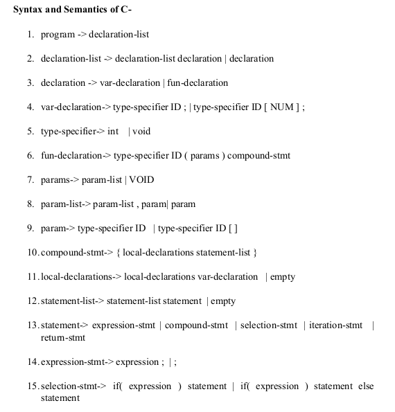
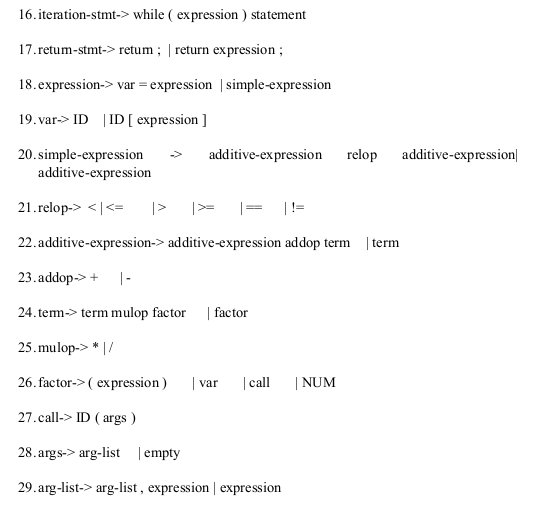

# lex-yacc

### Description

A simple Lexical Analyzer and a Syntax Analyzer for the language `C-` defined as below.

(Figure 1)

(Figure 2)

* `lexer.l` is the Lexical Analyzer.
* `parser.y` is the Parser (Syntax Analyzer)
* `lex.yy.c` is the compiled file from `lexer.l`

### To Run:

* Linux - Use `./compiler < testfile.c`

### In a need of compilation, run the makefile using `make -f MAKEFILE` (Linux).
